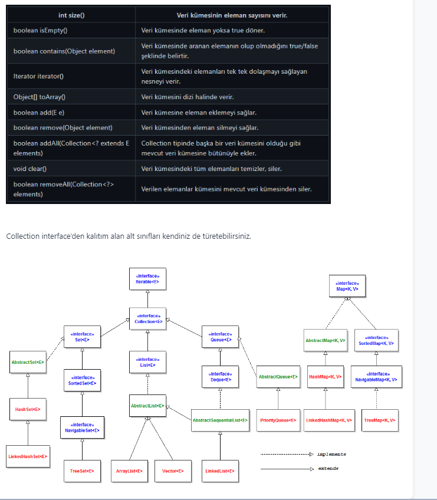

Collection Arayüzü (interface)

“Collection” interface’den kalıtım alan alt sınıflar “java.util” paketi altında toplanmıştır. “Collection” interface ile liste tipinde veri tutan bir veri yapısında hangi işlevlerin olması gerektiği belirtilmiştir. Liste tipinde veri tutacak olan her sınıf doğrudan veya dolaylı yoldan bu interface’den kalıtım almalıdır. Bu nedenle soyağacının en tepesinde “Collection” interface yer almaktadır.

Java Collection sınıfları ile liste halindeki veri üzerinde arama, ekleme, silme, sıralama gibi işlemler yapabilirsiniz.

Biliyoruzki interface’ler de birbirinden kalıtım alabilir. “Collection” interface’den kalıtım almış en önemli arayüzler “List”, “Queue”, “Set” interface’leridir.

Bu üç interface’den kalıtım alan alt sınıflar ise aşağıdaki gibidir.

List interface’den kalıtım alan alt sınıflar: ArrayList, LinkedList, Vector, Stack

Queue interface’den kalıtım alan alt sınıflar: PriorityQueue, ArrayQueue

Set interface’den kalıtım alan alt sınıflar: HashSet, LinkedHashSet, TreeSet

Collection interface’den türeyen alt sınıfların sağlamak zorunda olduğu fonksiyonlar:
